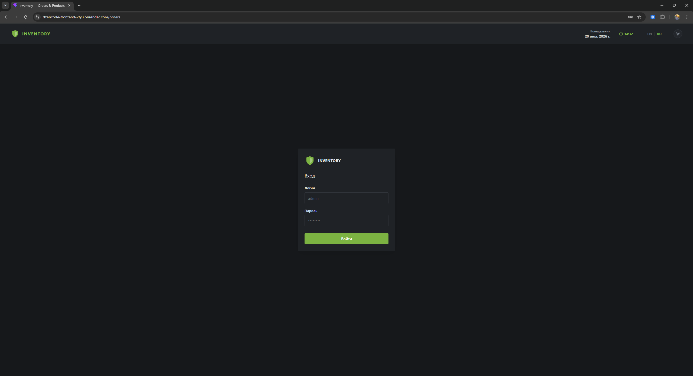
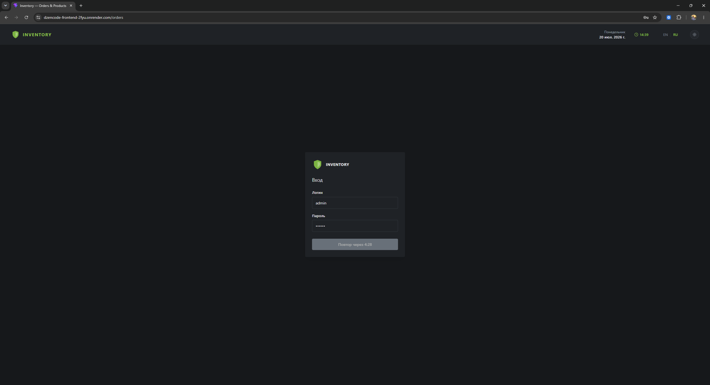
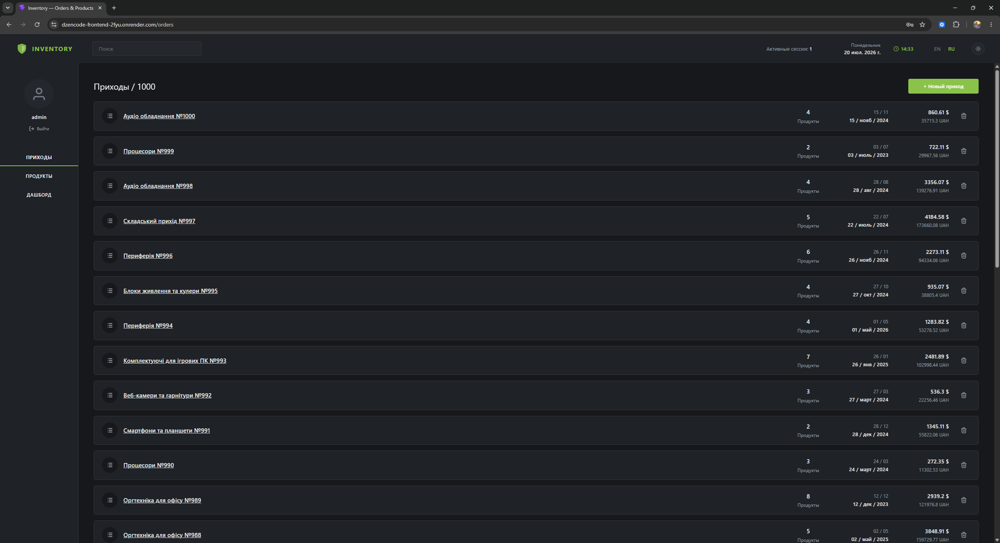
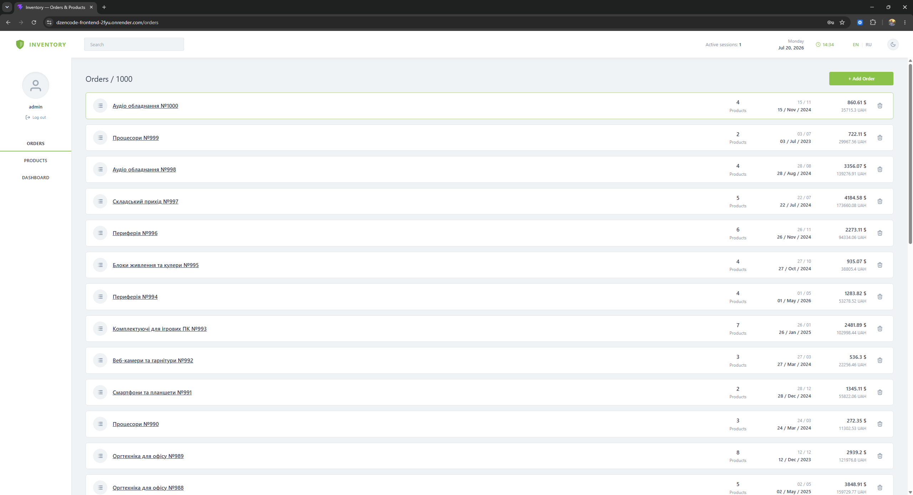
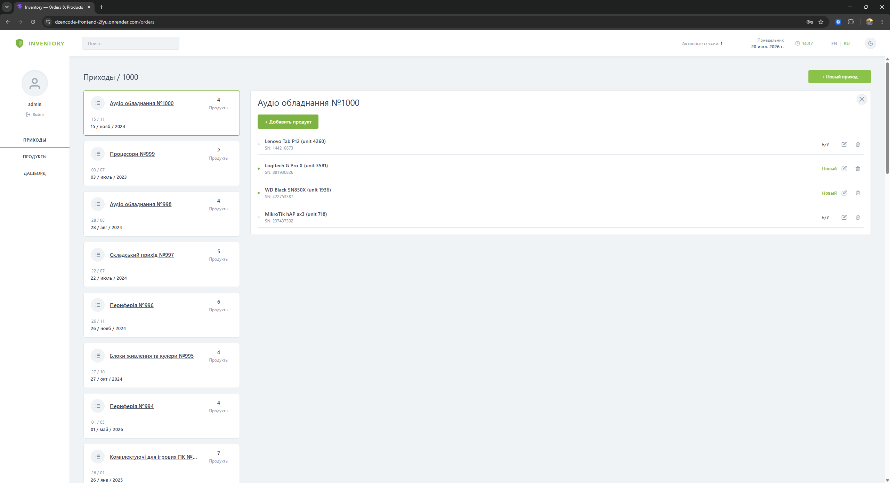
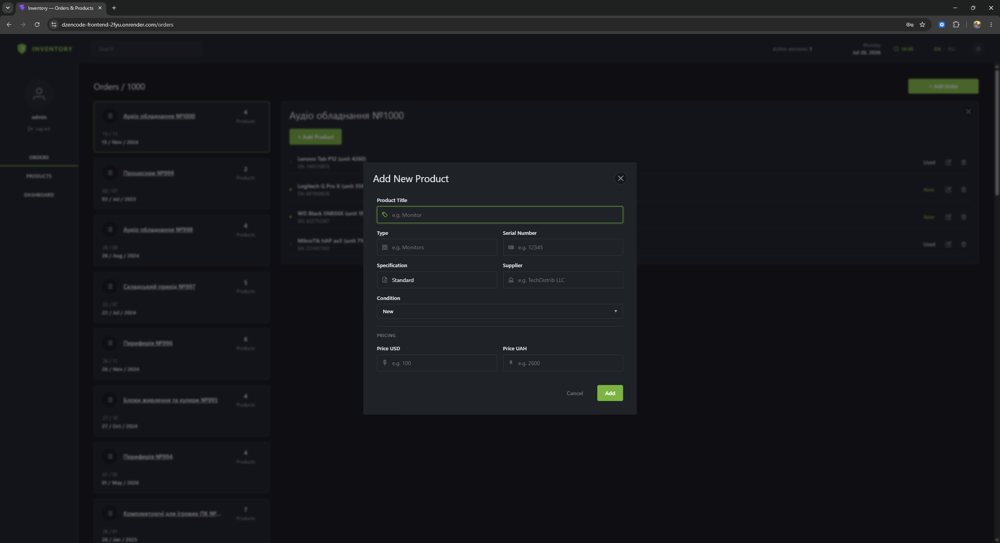
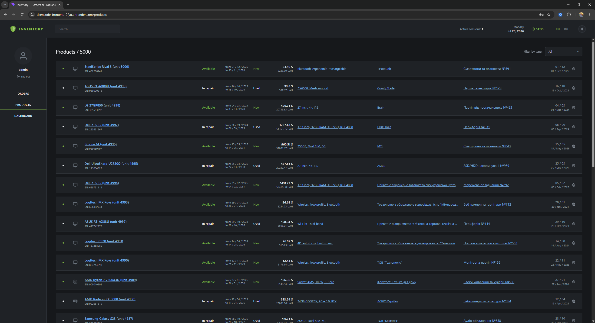
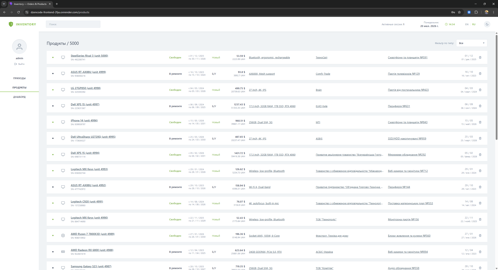
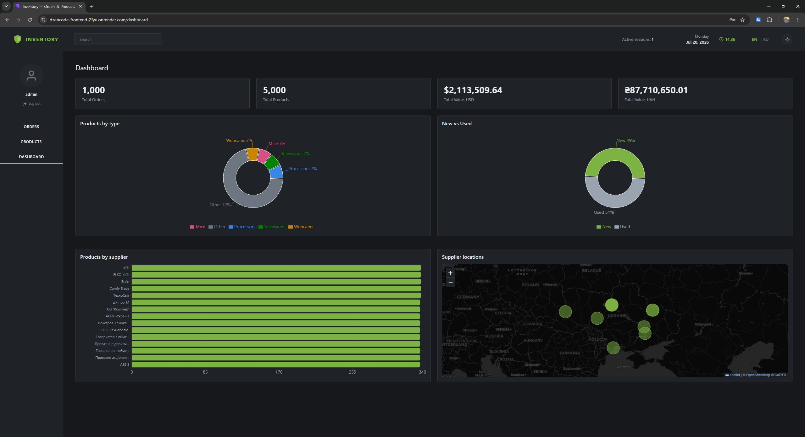

# Orders & Products — SPA (dZENcode Test Task)

A single-page inventory management application for tracking **Orders** and the **Products** within them, built as a test assignment for **dZENcode** (Junior+ level).

**Repository:** https://github.com/vladrlex/dzencode-test-task

**Live demo:**
- Frontend: https://dzencode-frontend-2fyu.onrender.com
- Backend API: https://dzencode-backend-yrku.onrender.com

**Demo login:** `admin` / `Demo12345!`

**Demo video:** https://www.loom.com/share/16e9e71cd08f471bb3ed38cf924fe460

> The backend is on Render's free tier and spins down after inactivity — the first request after a while can take up to ~50s to wake it up.

---

## Stack

| Layer | Technology |
|---|---|
| UI | React 19 + TypeScript |
| State | Redux Toolkit |
| Routing | React Router (with route-level code splitting via `React.lazy`) |
| Auth | JWT (backend-issued, verified per-request), rate-limited login |
| Real-time | Socket.io (active sessions counter) |
| Styling | CSS (BEM methodology) + Bootstrap grid/components on the Dashboard |
| Charts | Recharts |
| Maps | React Leaflet + OpenStreetMap |
| i18n | react-i18next (English / Russian) |
| Testing | Vitest + React Testing Library |
| Backend | Node.js + Express + MySQL (mysql2) |
| Containers | Docker + Docker Compose |

---

## Features

### Authentication
- The whole app sits behind a login screen. The backend issues a JWT on login; every `/api/orders` and `/api/products` request requires it.
- Session (token + username) persists in `localStorage`, so a page refresh doesn't log you out.
- Login is rate-limited (10 attempts / 15 min per IP) to slow down brute-force attempts.

### Top Menu
- Live clock and current date, localized to the selected language.
- Active sessions counter — number of open browser tabs/windows across all connected clients, synced via WebSocket.
- Global search across orders and products (debounced).
- Language switcher (EN/RU) — the choice persists in `localStorage`.
- Light/dark theme toggle — the choice persists in `localStorage`.

### Navigation Menu
- Route links between **Orders**, **Products**, and **Dashboard** pages.

### Orders
- Paginated list of all orders: title, product count, creation date in two formats, total sum in **USD** and **UAH**.
- Click an order to open a detail panel with the full list of products inside it, including add/edit/delete per product. The panel can be closed.
- Delete an order via a confirmation popup.

### Products
- Paginated list of all products: name, serial number, availability status, warranty dates in different formats, specification, supplier, price in different currencies, and the parent order's name.
- Filter by product type (select) and full-text search.
- Add / edit / delete a product from within an order.

### Dashboard
- Bar chart (Recharts) of products per supplier with exact counts.
- Map (React Leaflet + OpenStreetMap) plotting each supplier's city, marker size scaled by product count, with a popup showing the exact figure.
- Built with Bootstrap grid/cards, scoped to this page only — the rest of the app keeps its own hand-built BEM styling.

### i18n
- Full English/Russian translation coverage, including form placeholders and accessibility labels.

---

## Screenshots

**Login — dark theme, and the rate-limit cooldown after too many failed attempts**

 

**Orders — dark/Russian and light/English UI**

 

**Order detail panel — light theme, Russian**



**Add product form — dark theme**



**Products — dark/English and light/Russian UI**

 

**Dashboard — supplier chart and map, dark theme**



---

## Project Structure

```
dzencode-test-task/
├── backend/
│   ├── routes/          # orders, products, auth
│   ├── middleware/       # JWT auth guard
│   ├── sockets/          # active-sessions websocket
│   ├── migrations/       # incremental SQL migrations for existing databases
│   ├── schema.sql        # full schema (used on first container boot)
│   └── seed*.sql, seed.js, data.json  # demo data seeding
├── frontend/
│   ├── src/
│   │   ├── pages/        # Orders, Products, Dashboard, Login
│   │   ├── components/   # Layout, Modal, ProductCard, forms, etc.
│   │   ├── store/        # Redux slices (orders, products, auth)
│   │   └── i18n/, utils/, config/
│   └── public/locales/   # en/ru translation.json
└── docker-compose.yml
```

---

## Getting Started

### Option 1 — Docker (recommended)

**Requirements:** Docker Desktop installed and running.

```bash
git clone https://github.com/vladrlex/dzencode-test-task.git
cd dzencode-test-task
docker-compose up --build
```

- Frontend: [http://localhost:3000](http://localhost:3000)
- Backend / Socket.io: `http://localhost:5000`
- Login with `admin` / `Demo12345!` (seeded automatically on first boot)

### Option 2 — Local development

**Backend:**
```bash
cd backend
npm install
cp .env.example .env   # fill in DB credentials and a JWT_SECRET
npm start
```

**Frontend:**
```bash
cd frontend
npm install
cp .env.example .env   # points at http://localhost:5000 by default
npm run dev
```

The frontend dev server (Vite) will print the local URL to open, typically [http://localhost:5173](http://localhost:5173).

### Running tests

```bash
cd frontend
npm test
```

---

## Database

- `backend/schema.sql` — full schema, applied automatically on first MySQL container boot.
- `backend/migrations/` — incremental `ALTER TABLE` scripts to bring an already-running database up to date (e.g. adding the `supplier` column, adding the `users` table for auth) without losing data.
- `backend/db_schema.mwb` — MySQL Workbench EER diagram of the schema, for visual comparison against what's actually implemented.

---

## Self-check

Before submitting, the project was launched from a clean clone using only the instructions in this README to confirm setup accuracy, and the live Render deployment was smoke-tested end-to-end (login, protected API routes, CRUD on orders/products).
